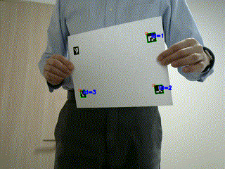

# vpi_perspective_warp_aruco

## What does this application do?
This application demonstrates the [Perspective Warp](https://docs.nvidia.com/vpi/algo_persp_warp.html) function of [NVIDIA VPI](https://developer.nvidia.com/embedded/vpi) with [OpenCV ArUco](https://docs.opencv.org/master/d5/dae/tutorial_aruco_detection.html) module.



## Prerequisites
- NVIDIA Jetson Series Developer Kits
- NVIDIA JetPack 4.5 or later 
- USB Camera

## Installation
1. Install OpenCV which includes the ArUco module. The pre-installed OpenCV of JetPack does not include the ArUco module. The [install_opencv4.5.0_Jetson.sh](https://github.com/AastaNV/JEP/blob/master/script/install_opencv4.5.0_Jetson.sh) script can be used to build OpenCV with ArUco module in addtion to the GPU support. The build takes 2~3 hours on Jetson.
1. Download this repository.
    ```
    $ git clone https://github.com/MACNICA-CLAVIS-NV/vpi_perspective_warp_aruco
    ```
1. Build the application.
    ```
    $ cd vpi_perspective_warp_aruco
    $ mkdir build
    $ cd build
    $ cmake ..
    $ make
    ```

## Execution
1. Print [the marker sheet](./marker_sheet.pdf).
1. Excute the application and place the marker sheet in front of the camera.
```
$ ./vpi_perspective_warp_aruco --video video_file_to_be_warped
```
### Example
```
./vpi_perspective_warp_aruco --video /opt/nvidia/vpi1/samples/assets/dashcam.mp4
```

```
